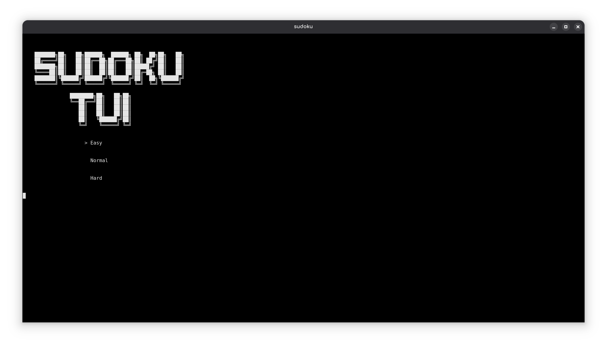
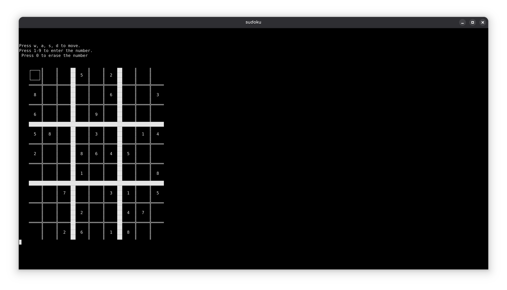

# Sudoku TUI

A cross-platform, interactive Terminal User Interface (TUI) Sudoku game built from scratch. It features real-time keystroke detection for fluid gameplay and low-level audio playback via `miniaudio.h` without relying on heavy game engines.

## Screenshots

<p align="center">
    
    
    
</p>

## Features

- **Cross-Platform Performance:** Native support for both Linux and Windows systems.
- **Interactive TUI Control:** Smooth navigation using `W`, `A`, `S`, `D` keys with instant response handling.
- **Sound Engine:** Dynamic background music and sound effects utilizing the low-level `miniaudio.h` library.
- **Multiple Difficulties:** Play through Easy, Normal, or Hard procedural Sudoku grids.
- **State Management:** Quick erase options (`0` key) and full persistence support to continue games.

---

## Controls

| Key               | Action                                         |
| ----------------- | ---------------------------------------------- |
| **W / A / S / D** | Move selection cursor up, left, down, or right |
| **1 - 9**         | Place number in the active grid cell           |
| **0**             | Erase the number in the active cell            |

---

## Technical Stack & Low-Level Mechanics

- **Language:** C, Bash
- **Audio Backend:** `miniaudio.h` (single-header hardware abstraction layer interacting directly with ALSA/PulseAudio on Linux and WASAPI on Windows).
- **Input Processing:** Non-blocking raw keyboard state detection to ensure instant UI responsiveness without needing to press `Enter`.

---

## Getting Started

### Prerequisites

Ensure you have a C/C++ compiler (`gcc`/`g++` or MSVC) installed on your system.

#### On Linux:

You may need the development headers for your audio subsystem (ALSA or PulseAudio):

```bash
sudo apt-get install libasound2-dev
```

### Run the game

Run the 'run' file according to your OS.

#### On Linux:

1. Give the necessary permission to the file:

```bash
chmod +x run.sh
```

2. `Double-click` the file or, `right-click` then `run as a program`.

#### On Windows:

`Double-click` the file or, `right-click` then `run as a program`.

### Compile the game

### On Linux:

```bash
 gcc ./src/main.c ./src/welcome.c ./src/sudoku.c ./src/input.c ./src/audio.c -lpthread -lm -o sudoku && ./sudoku
```

### On Windows:

```bash
 gcc ./src/main.c ./src/welcome.c ./src/sudoku.c ./src/input.c ./src/audio.c -lwinmm -o sudoku && ./sudoku
```
